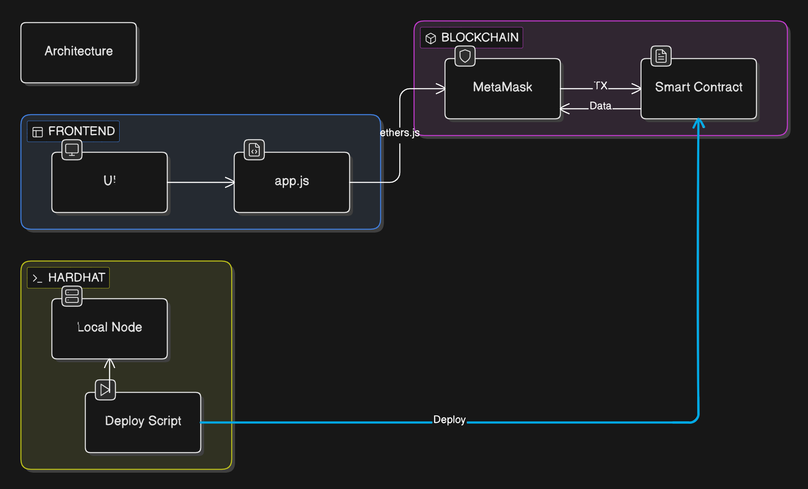
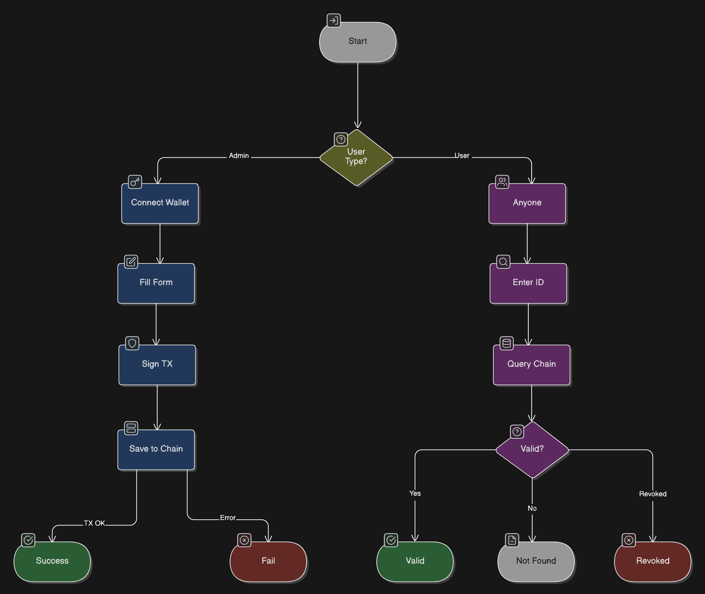
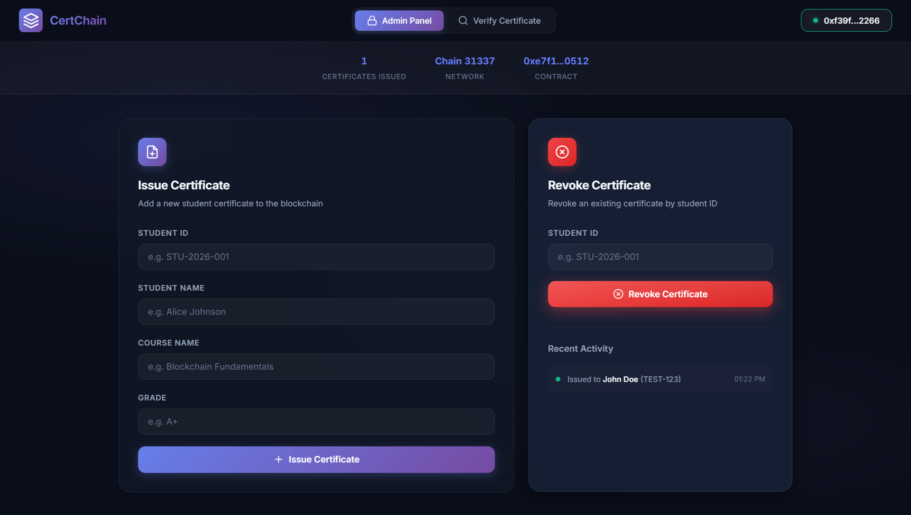
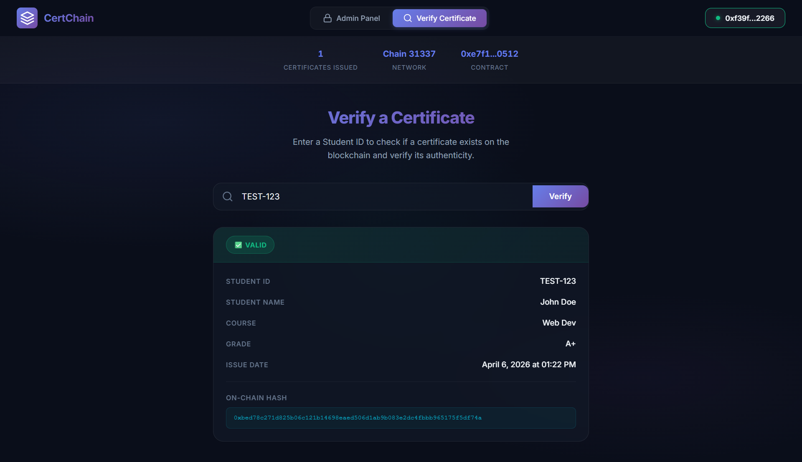

# CertChain

> A decentralized application for issuing and verifying academic certificates on the Ethereum blockchain.

[](https://opensource.org/licenses/MIT)
[](https://hardhat.org/)
[](https://soliditylang.org/)
[](https://docs.ethers.org/v6/)

---

## Architecture



---

## Application Flow



---

## Tech Stack

| Layer          | Technology              |
| -------------- | ----------------------- |
| Smart Contract | Solidity 0.8.20         |
| Framework      | Hardhat v3 (ES Modules) |
| Frontend       | Vanilla HTML / CSS / JS |
| Wallet Bridge  | Ethers.js v6 (CDN)      |
| Wallet         | MetaMask                |

---

## Prerequisites

- [Node.js](https://nodejs.org/) v18 or higher
- [MetaMask](https://metamask.io/) browser extension

---

## Quick Start

### 1. Install Dependencies

```bash
npm install
```

### 2. Compile the Smart Contract

```bash
npm run compile
```

### 3. Run Tests

```bash
npm run test
```

### 4. Start Local Blockchain

Open a terminal and keep it running:

```bash
npm run node
```

_Note: This starts a local Ethereum node at `http://127.0.0.1:8545` with 20 pre-funded accounts._

### 5. Deploy the Contract

In a **new** terminal:

```bash
npm run deploy
```

_Note: This deploys the contract and auto-generates `frontend/config.js` with the contract address and ABI._

### 6. Configure MetaMask

1. Open MetaMask > **Settings** > **Networks** > **Add Network** > **Add a network manually**
2. Enter the following details:
   - **Network Name:** Hardhat Local
   - **New RPC URL:** `http://127.0.0.1:8545`
   - **Chain ID:** `1337` (or `31337` if MetaMask prompts an error)
   - **Currency Symbol:** `ETH`
3. Save and switch to the new network
4. Click your account icon > **Import Account**
5. Paste a private key from the `npm run node` output (Account #0 is the admin account)

### 7. Start Frontend

```bash
npm run serve
```

Open `http://127.0.0.1:3000` in your browser.

---

## Usage

### Admin (Contract Deployer)

1. Click **Connect Wallet** using the deployer account (Account #0)
2. Navigate to the **Admin Panel** tab
3. Fill in Student ID, Name, Course, and Grade, then click **Issue Certificate**
4. To revoke, enter the Student ID and click **Revoke Certificate**

### Public (Verification)

1. Navigate to the **Verify Certificate** tab
2. Enter a Student ID and click **Verify**
3. The certificate details, validity status, and on-chain hash will accurately display based on blockchain data

---




## Project Structure

```text
Certificate-DApp/
├── contracts/
│   └── CertificateVerification.sol     # Smart contract logic
├── scripts/
│   └── deploy.js                       # Deployment automation
├── test/
│   └── CertificateVerification.test.js # Core unit tests (18 specs)
├── frontend/
│   ├── index.html                      # UI layout
│   ├── index.css                       # Minimalist dark-mode design
│   ├── app.js                          # Blockchain interaction logic
│   └── config.js                       # Auto-generated contract config
├── hardhat.config.js                   # Network and compiler configuration
├── package.json                        # Dependencies and task scripts
└── .gitignore                          # Version control exclusions
```

---

## Smart Contract Functions

| Function                                    | Access     | Description                                 |
| ------------------------------------------- | ---------- | ------------------------------------------- |
| `issueCertificate(id, name, course, grade)` | Admin only | Stores a certificate on-chain               |
| `verifyCertificate(studentId)`              | Public     | Returns certificate data                    |
| `revokeCertificate(studentId)`              | Admin only | Marks certificate as revoked                |
| `getCertificateHash(studentId)`             | Public     | Returns keccak256 hash for tamper detection |
| `totalCertificates()`                       | Public     | Returns count of issued certificates        |

---

## Troubleshooting

**MetaMask nonce error after restarting the node:**
Navigate to MetaMask > Settings > Advanced > Clear activity tab data

**Contract not found errors:**
Re-deploy with `npm run deploy` after restarting `npm run node` to refresh the state

---

## Future Features

- **Multi-Admin Support**: Allow multiple universities or institutions to issue certificates securely
- **IPFS Integration**: Store certificate PDFs on IPFS and save the content hash on-chain
- **NFT Certificates (ERC-721)**: Mint each certificate as a transferable NFT directly reading in the student wallet
- **Network Deployment**: Establish pipelines for Sepolia or Ethereum mainnet deployment
- **QR Code Verification**: Generate a scannable code linking directly to the verification portal
- **Batch Issuance**: Support CSV uploads to issue multiple certificates in a single transaction
- **Extended Fields**: Support institution name, date of birth, category, and expiry metadata
- **Event Dashboard**: Trace full timelines of all on-chain issuance and revocation events
- **Email Notifications**: Dispatch updates to students automatically upon issuance or revocation
- **PDF Export**: Generate styled certificates dynamically via the verification page

---

## License

MIT
